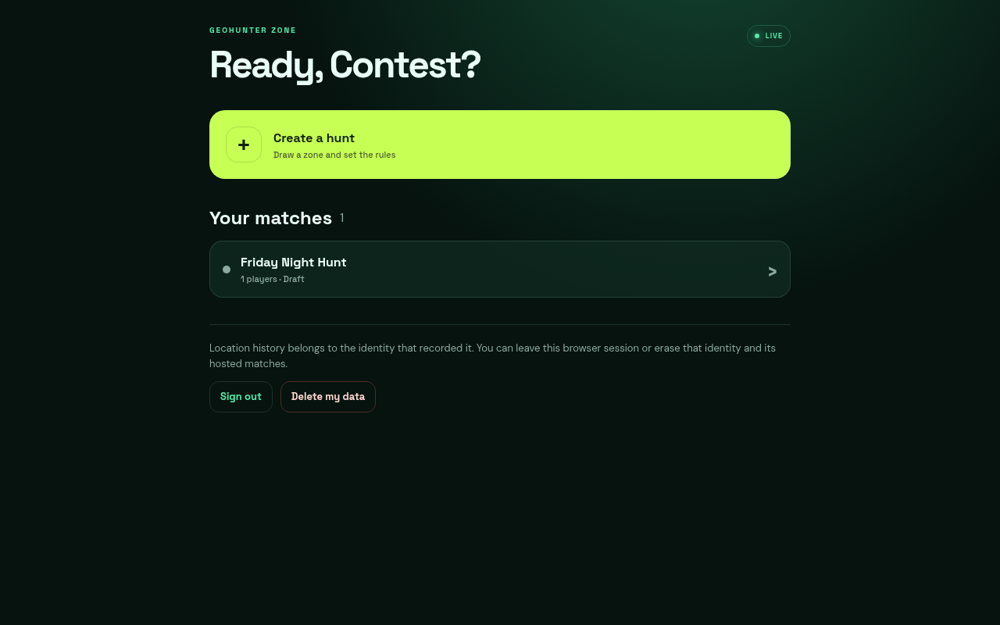
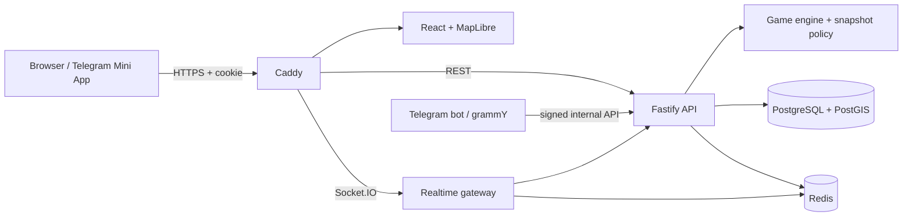

<p align="center">
  
</p>

# GeoHunt

<p align="center"><strong>GeoHunter Zone</strong> — a server-authoritative, mobile-first hide-and-seek game for the web and Telegram.</p>

<p align="center">
  <a href="https://github.com/ClydeGluten/GeoHunt/actions/workflows/verify.yml"></a>
  
  
  
</p>



Players draw a real-world arena, split into hiders and seekers, and play against configurable visibility pulses, GPS-quality rules, boundary penalties, and tag mechanics. The server—not the browser—decides which positions each participant may see and whether a tag is valid.

## Judge it in one command

```bash
./scripts/judge-demo.sh
```

Open **http://localhost:8080**, choose any trail name, then select **Create a hunt**. The script builds the all-in-one image, generates disposable local secrets, runs migrations, and waits for the readiness probe. Telegram credentials are not required for this path.

### Do this, then watch this

To skip setup and immediately watch a complete deterministic match:

```bash
./scripts/judge-demo.sh demo
```

Open the printed `?demo=1` URL. One seeker and two hiders move along predetermined routes through the production Socket.IO location pipeline. Watch the live phase timer, visibility updates, and player movement. The match finishes automatically in about 65 seconds; then select **View replay** to inspect the recorded routes or use **Export replay** to download its JSON.

The demo endpoint exists only while `DEMO_MODE=true`; the regular launcher keeps it disabled.

```bash
./scripts/judge-demo.sh status  # inspect the container
./scripts/judge-demo.sh logs    # follow service logs
./scripts/judge-demo.sh reset   # remove the stack, volumes, and local demo secrets
```

Prerequisites: Docker with the Compose plugin, OpenSSL, and `curl`. The first build downloads container images and JavaScript dependencies. If a default port is busy, reset any existing judge stack and choose alternates:

```bash
./scripts/judge-demo.sh reset
GEOHUNT_JUDGE_WEB_PORT=18080 \
GEOHUNT_JUDGE_HTTPS_PORT=18443 \
GEOHUNT_JUDGE_POSTGRES_PORT=55433 \
  ./scripts/judge-demo.sh
```

The launcher uses a separate Compose project and project-scoped volumes, so resetting the judge demo does not remove a normal `geohunter` stack.

## What is custom here

This is not a map-themed CRUD shell. The repository contains a purpose-built game domain and the infrastructure needed to run it:

| Area               | Project-specific implementation                                                                                | Start reading                                                                                                  |
| ------------------ | -------------------------------------------------------------------------------------------------------------- | -------------------------------------------------------------------------------------------------------------- |
| Game rules         | Match phases, timeout winners, tags, visibility pulses, stale-location handling                                | [`packages/game-engine/src/index.ts`](packages/game-engine/src/index.ts)                                       |
| Spatial authority  | PostGIS playzones, accepted-location sequencing, accuracy/freshness checks, server-side tag distance           | [`apps/api/src/store.ts`](apps/api/src/store.ts)                                                               |
| Per-viewer secrecy | A different snapshot is projected for each socket according to role and visibility policy                      | [`apps/api/src/snapshot.ts`](apps/api/src/snapshot.ts), [`apps/api/src/realtime.ts`](apps/api/src/realtime.ts) |
| Concurrent state   | Match-row locks, atomic role/timer/tag/session transitions, single-winner finalization                         | [`apps/api/src/store.integration.test.ts`](apps/api/src/store.integration.test.ts)                             |
| Dual entry paths   | Cookie-backed browser identities plus validated Telegram Mini App sessions and chat grants                     | [`apps/api/src/routes.ts`](apps/api/src/routes.ts), [`apps/bot/src/index.ts`](apps/bot/src/index.ts)           |
| Operations         | One image can run Caddy, React, Fastify, Socket.IO, grammY, PostGIS, Redis, migrations, and an optional tunnel | [`Dockerfile`](Dockerfile), [`infra/all-in-one/entrypoint.sh`](infra/all-in-one/entrypoint.sh)                 |

The implementation evidence and baseline-to-contest comparison are collected in [`docs/implementation-report.md`](docs/implementation-report.md). The player-facing release notes live in [`CHANGELOG.md`](CHANGELOG.md).

## Architecture



### Trust boundaries

- Clients submit observations and intentions; they do not choose winners, visibility, distance, roles, or authoritative timestamps.
- PostgreSQL transactions serialize lifecycle, role, tag, timer, and identity replacement operations.
- Redis coordinates rate limits, presence, visibility pulse state, and realtime fan-out.
- Socket sessions are revalidated after connection, so revoking or replacing the cookie session also removes realtime access.
- Browser identities may host full games. Telegram is an integration, not a prerequisite.

## Main game loop

1. A host draws a polygon and chooses duration, hiding time, tag modes, GPS tolerances, boundary behavior, and visibility rules.
2. Players review separate location and replay disclosures before joining.
3. The host assigns roles and starts the hiding phase.
4. Accepted location updates advance monotonically by client sequence. Stale, implausible, or inaccurate observations are rejected or handled by policy.
5. Every connected viewer receives a role-filtered snapshot. Emergency reveals and boundary events are audited.
6. Tags are rechecked against current database positions, cooldown, deadline, role, status, and radius in the same transaction that applies the result.
7. A finished match can be replayed, published to its participants, exported, or deleted by its host.

## Verification

The same gates used for the contest build are available locally:

```bash
pnpm install --frozen-lockfile
pnpm test
pnpm test:integration
pnpm lint
pnpm typecheck
pnpm build
pnpm format:check
```

Database-backed integrity tests run when `TEST_DATABASE_URL` points to a migrated PostgreSQL/PostGIS database. GitHub Actions provisions that service automatically. See [`docs/testing.md`](docs/testing.md) for the test matrix and [`docs/implementation-report.md`](docs/implementation-report.md) for the latest recorded run.

## Local development

Requires Node.js 24+, pnpm 11.19.0, PostgreSQL with PostGIS, and Redis.

```bash
pnpm install --frozen-lockfile
pnpm build
pnpm dev
```

Copy [`.env.example`](.env.example) when running the complete Compose stack manually. Its values are local placeholders; replace every secret before any public deployment.

## Telegram and remote phones

Localhost works for the browser demo. Telegram Mini Apps and remote phone geolocation require a public HTTPS origin.

- `TUNNEL_MODE=quick` starts a temporary Cloudflare tunnel.
- `TUNNEL_MODE=named` uses `CLOUDFLARED_TUNNEL_TOKEN` and a stable `PUBLIC_WEBAPP_URL`.
- Set a real BotFather token and select `BOT_MODE=polling` or `BOT_MODE=webhook`.

Deployment, backup, restore, and tunnel details are in [`docs/operations.md`](docs/operations.md).

## Privacy and safety

GeoHunt handles precise location history. Both the host and every joining player must explicitly accept separate location and replay disclosures. Participants can sign out or permanently delete their identity and associated data from the dashboard; hosts can delete whole matches. A host must still obtain informed consent and choose an appropriate play area.

Read [`PRIVACY.md`](PRIVACY.md) before running a real game. The current build does **not** provide a finished age/minor policy, background-location guarantee, or emergency-service function.

## Repository map

```text
apps/web        React PWA, MapLibre map, browser/Telegram entry flows
apps/api        Fastify REST API, Socket.IO gateway, persistence boundary
apps/bot        grammY bot and signed chat hand-off
packages/       shared contracts, game engine, PostGIS schema and migrations
infra/          Caddy, Nginx, database-role, health, and container scripts
tests/e2e       browser and multi-client lifecycle scenarios
docs/           architecture, operations, verification, and implementation evidence
.agents/        attributed development references; never shipped at runtime
```

## Documentation

- [Implementation report and originality boundary](docs/implementation-report.md)
- [Architecture and security boundaries](docs/architecture.md)
- [Verification matrix](docs/testing.md)
- [Deployment and backups](docs/operations.md)
- [Development tools and research](docs/development-tooling.md)
- REST/OpenAPI after launch: [`http://localhost:8080/api/docs`](http://localhost:8080/api/docs)
- Readiness probe: [`http://localhost:8080/api/ready`](http://localhost:8080/api/ready)

## License status

The project owner has not selected a repository-wide open-source license yet. The vendored development references under [`.agents/`](.agents/) retain their own MIT notice. Runtime dependencies keep their respective upstream licenses.
